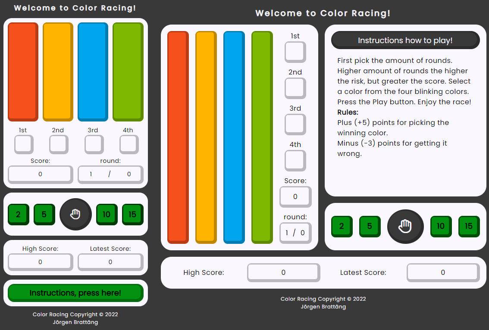

# Color Racing
Is where you can get race different colors to see who is the fastest, it's a fun way to just have something to do while you wait for something or just want to have a bit of fun.

<a href="https://jorgenbrattang.github.io/Color-racing/" title="Link to live website" rel="nofollow">View live website here!</a>

## Table of contents
- [UX](#uX)
    - [Development](#development)
    - [Strategy](#strategy)
    - [Scope](#scope)
    - [Structure](#structure)
    - [Skeleton](#skeleton)
    - [Surface](#surface)
    - [Changes during the design process](#changes-during-the-design-process)
    - [Typography](#typography)
    - [colorScheme](#colorScheme)
    - [Features](#features)
- [Testing](#testing)
       - [unfixedBugs](#unfixed-Bugs)
- [Technologies used](#technologies-used)
    - [Main Language used](#main-Language-Used)
    - [Frameworks Libraries & Programs Used](#frameworks-Libraries-&-Programs-Used)
- [Credits](#credits)
    - [Tutorials](#tutorials)
    - [What I learned](#what-I-learned)
    - [Continued development](#continued-development)
    - [Author](#author)
    - [Acknowledgements](#acknowledgements)

# UX

## Development
The development of this website started with getting a feel for how that could manage to get colors to race each other, and the logical thing was gravity simulated with a progressbar that goes for 10% to 100%. And for the user to be able to choose which color to race with, and how many tries to try to get it the highest score possible.

## Strategy
To achieve this the developer have to first learn how to do a progressbar and how to control it's movements with control, once that is achieved the developer need a way to randomize the movement of the progress bar and how to get so there is always one winner and no one with the same number. 

After that it's straight forward on just placing buttons and get them to control first, how many rounds there is to be played. After that which color to be raced and a loading phase where you have to wait until the race is over. And then start the whole thing over until the chosen number of rounds is achieved so we can get a latest score and possible a high score if that was achieved.

## Scope
To achieve the scope of this project the game has to have these criteria:
- Instructions how to play the game
- Intuitive design on how and where to press to progress through the game
- Feedback on when you press something, so you know you picked the right thing
- Alerts if something the user did in advance, and how to guide them to the right path
- The achievement when the user finished the game, high score and a latest score

Onces these criteria has been meet the game will function well and have achieved the purpose.

## Structure
First the user will arrive at the landing page which you are greeted with the instructions how to play the game, and blinking buttons where you are suppose to press to go about the game.

Each action taken will be meet with an appropriated action to progress the game.


## Skeleton
The skeleton was made using <a href="#" title="Link to Balsamiq website">Balsamiq</a>
<details><summary>Skeleton</summary>

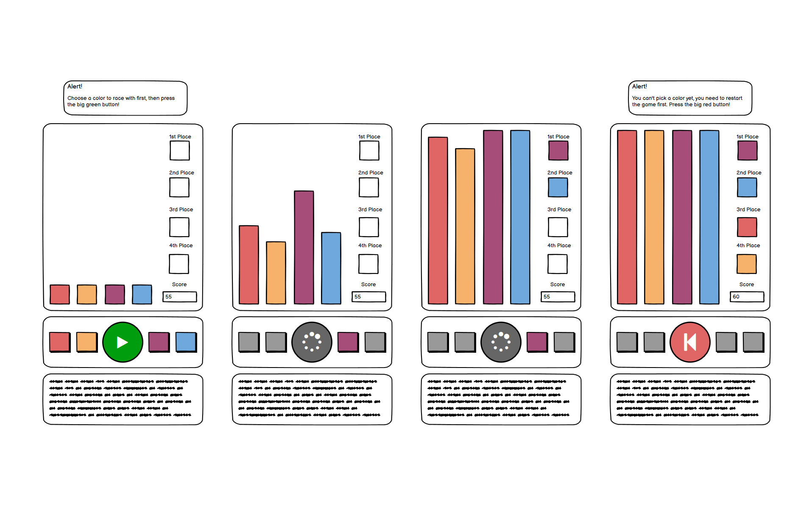

</details>

## Surface
The surface was made using the skeleton, just with some better graphics. 

## Changes during the design process
The surface was changed a lot during the development of this project due to feedback from mentor and family, for example the game lacked a goal at first. That came to mind quite quickly after the skeleton was made and what came to be the basic coding of the game. 

The game needed to have a goal, which was declared to be a high score and a latest score. To let the user see what their recent achievements had been, and a way to let the user choose the number of difficulty to gain a higher score which introduced the round selection. After those changes the user feedback needed a simpler way to go about the game which lead to flashing buttons to guide the user towards pressing the right button at the right time.

## Typography
For easier reading the developer chose <a href="#" title="Link to google fonts Poppins">Poppins</a> from <a href="#" title="Link to google fonts">Google Fonts</a>, and a backup of sans serif.

## colorScheme
The style utilizes a range of colors that contrast each other towards the background but compliments each other.
<p style="padding: 10px; background-color: #685465">#685465<p>
<p style="padding: 10px; background-color: #A96C7B">#A96C7B<p>
<p style="padding: 10px; background-color: #E38C79">#E38C79<p>
<p style="padding: 10px; background-color: #FFBC6C">#FFBC6C<p>
<p style="padding: 10px; background-color: #00A97F">#00A97F<p>
<p style="padding: 10px; background-color: #8685EF">#8685EF<p>
<p style="padding: 10px; background-color: #FAF7FF; color: black">#FAF7FF<p>
<p style="padding: 10px; background-color: #C9C9C9">#C9C9C9<p>
<p style="padding: 10px; background-color: #393939">#393939<p>

## Features
The features holds a number of elements that will guide the user throughout the game, so it's easy to follow along. Even without the explanatory text, you can just follow the blinking lights and get a grasp on how the game works.

With that said, here are the features:

### <u>Welcome Text</u>
- The first thing that you may see is the "Welcome to Color Racing! text. Nothing special about this.

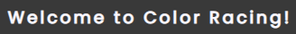

### <u>Color pillars</u>
- The first thing after the welcome text you will see onces entering the site will probably be the pillars of colors. Those represents the racing colors that are help up by a standing progressbar. And onces activated these will restart at their starting line and race towards the bottom of their field.

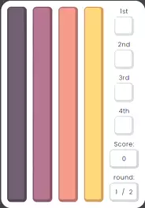

### <u>Rounds Blinking</u>
- The second thing you may notice is the blinking buttons that holds numbers on them. And those are the buttons that will let you choose the amount of rounds that will be played. The higher the number chosen then greater the gain or loss.
    - These will change in opacity onces you press on one, and the one you chose will remain in the same color.

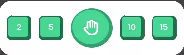

### <u>Blinking Hand</u>
- Onces that have been pressed, a new button will start flashing. Thats the submit button that will tell the game that the amount of rounds have been chosen, if it has not been chosen an alert will appear that will tell you that you need to choose a number of rounds before proceeding.

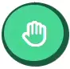

### <u>Colors blinking</u>
- After the choosing of rounds, the buttons will change to the racing colors so you can pick your champion. The same thing will happen to these buttons, they will flash so you know where to press next to progress the game.
    - As the rounds choosing buttons these too will change in opacity accordingly to the one pressed.

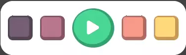

### <u>Hand blinking to praying figure</u>
- When the user have chosen their color to be raced, they will be guided to the "Play" button which will start the race. So onces pressed this button will change into a praying figure thats grey and blinking, and the race have commenced.

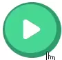

### <u>Colors racing</u>
- The race have now commenced, and the previous mentioned progress bars that are represented by the different colors will start race towards the bottom of their field. Onces they enter the bottom of the field, the winning board to the right / bottom of the racing colors will now change accordingly to their position when finishing.
    - These will change as mentioned to the color which came first, second, third and forth.


### <u>Score changing</u>
- As the race is finished, you can see your score changing. If you won you will see a green flashing light that indicates that you picked the right color to win, and if it lost you will see a red flashing light.
    - This will give you points of either plus 5, or negative 3 points.

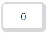

### <u>Reset Button</u>
- After one round is finished, the user will be meet with the restart race button. Which will like the others start flashing, so the user knows where to press next. And onces pressed the user will need to choose a color again.
    - It will not start the whole thing over, so the amount of rounds that will be played it's not changing.

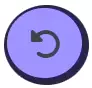

### <u>Changing rounds</u>
- Onces pressed the restart button, the rounds box will now increase with 1. So the user knows that the have progressed and know how many rounds there are left of the game.
   - Example:  1/5 to 2/5

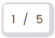

### <u>High and latest Score</u>
- When the player have reached the whole amount of rounds that have been played, their score will be submitted to the "latest" scoreboard. And if their score is higher then the current highScore it will also change.
    - The latest scoreboard will flash green if it is greater than the high score and red if it is lower. Same with the high score it will do the same.

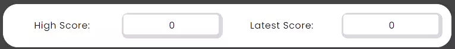<br>
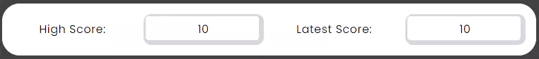

### <u>New Game</u>
- Now the user has a choice, either stop playing or continue to try to reach a higher score then before. And to to that they will be meet with a new flashing button that will let them start a new game. And after it's been pressed they will be meet with the choosing of the amount of rounds and onward.

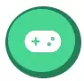

### <u>Instructions</u>
- If the game didn't explain it self, the user has an instructions button that will tell the basic of the game, how it works and how much that will be gain or lost when racing.
    - The text will automatically appear when entering in an landscape mode, but will only be a button to be pressed when using a portrait mode to save space. It can be closed in both modes if the user decides it to be closed.
    - The text of the button will also be changed, to utilize the space. "Instructions, press here!" to "Instructions, how to play!"

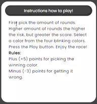

### <u>CopyRight</u>
- And last, you may see the copyright text at the bottom of the page. Which holds the Author of the site and the year.

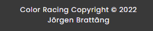

<br>

# Testing
To see the testing part, please follow this link: <a href="https://github.com/JorgenBrattang/Color-racing/blob/main/TESTING.md">Testing.md</a>

## Unfixed Bugs
- One issue that I have not found an answer to is when sometimes when working with the inspect window in chrome, it can suddenly just change the size of the screen without adding or removing code. But it will be fixed with reloading the page, so I will keep research towards getting a clear answer to this problem.

- Am I Responsive bug when using the this code, pulls the page up in the viewport. Could not find a fix for it, it works just fine when browsing normally.
```
document.querySelector("#myDropdown").scrollIntoView({
        behavior: "smooth",
```


# Technologies used

## Main Language Used
- HTML
- CSS
- Javascript

## Frameworks Libraries & Programs Used

- <a href="https://fonts.google.com/" title="Link to google fonts" rel="nofollow">Google Fonts</a>
    - Google fonts was used to import the font "Poppins".
- <a href="https://fontawesome.com/" title="Link to font awesome" rel="nofollow">Font awesome</a>
    - Font Awesome was used on almost all pages throughout the website to import icons (e.g. play button) for UX purposes.
- <a href="https://gitpod.io/" title="Link to gitpod" rel="nofollow">GitPod</a>
    - GitPod was used for writing code, committing, and then pushing to GitHub.
- <a href="https://github.com/" title="Link to github" rel="nofollow">Github</a>
    - GitHub was used to store the project after pushing
- <a href="https://balsamiq.com/" title="Link to balsamiq" rel="nofollow">Balsamiq</a>
    - Balsamiq was used to create the wireframes during the design phase of the project.
- <a href="https://www.freeformatter.com/html-formatter.html" title="Link to freeformatter" rel="nofollow">freeformatter</a>
    - Freeformatter was used to compressed my code to be more readable.
- <a href="https://gauger.io/fonticon/" title="Link to fonticon" rel="nofollow">Fonticon</a>
    - Fonticon was used to create a favicon.ico to the title.
- <a href="https://ezgif.com/video-to-webp/" title="Link to fonticon" rel="nofollow">EZGIFs</a>
    - EZGIFs was used to convert and crop videos for testing and features.

    


## Deployment
To deploy this page to GitHub Pages from its GitHub repository, the following steps were taken:

1. Log into <a href="https://github.com/login" title="Link to GitHub login" rel="nofollow">GitHub</a> or <a href="(https://github.com/join)" title="Link to GitHub join" rel="nofollow">Create an account</a>.
2. Locate the <a href="https://github.com/JorgenBrattang/staying-healthy" title="Link to GitHub Repository" rel="nofollow">GitHub Repository</a>.
3. At the top of the repository, select Settings from the menu items.
4. Scroll down the Settings page to the "Pages" section.
5. Under "Source" click the drop-down menu labelled "None" and select "Main".
6. Upon selection, the page will automatically refresh meaning that the website is now deployed.
7. Scroll back down to the "Pages" section to retrieve the deployed link.

# Credits
## Tutorials

- <a href="https://www.youtube.com/watch?v=XF1_MlZ5l6M" title="Learn JavaScript Event Listeners In 18 Minutes">Learn JavaScript Event Listeners In 18 Minutes</a>

- <a href="https://www.w3schools.com/js/default.asp" title="Learn JavaScript on w3schools">Learn JavaScript from w3schools</a>

## What I learned
That the developer learned from this project was the understanding of some core concepts how to read and write code, to get a better understanding on how to build up a working code by following some basic rules. Which will be most useful throughout the developers career.

## Continued development
To further develop this game, it would be to add more features like an online high score list. The ability to change the color scheme of the site by either choosing their own or by presets.

## Author
Student of Code Institute, Jörgen Brattäng

## Acknowledgements
I would like to acknowledge my mentor <a href="https://github.com/seunkoko" title="Link to GitHub profile" rel="nofollow">Oluwaseun Owonikoko</a> which gave my game a goal, which I did not think about. My family for helping me progress and support me, and not to forget the tutors and community of slack that helped me understand how to understand the concepts of programming JavaScript.
