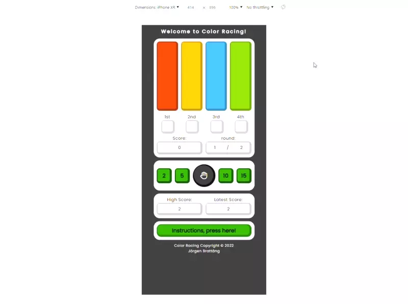
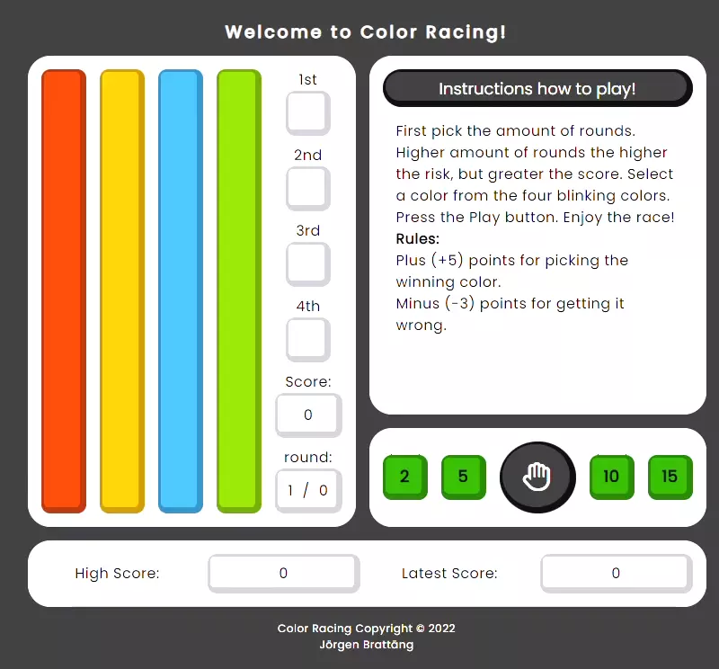
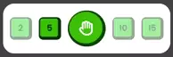
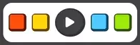
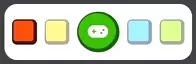
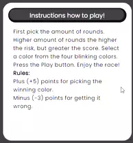
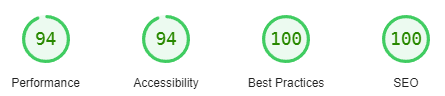
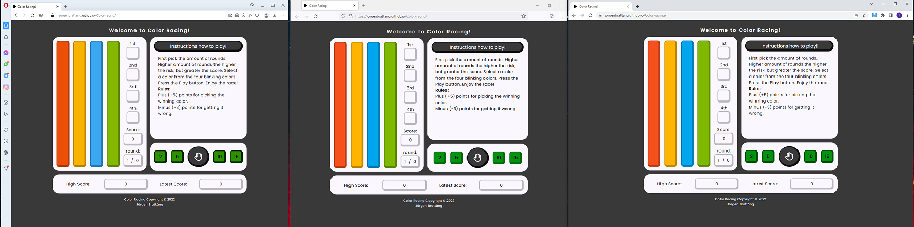

# Links
- <a href="https://github.com/JorgenBrattang/color-racing/blob/main/README.md">README.md</a>
- <a href="https://jorgenbrattang.github.io/color-racing/" title="Link to live website" rel="nofollow">View live website here!</a>

# Table of content
- <strong>[Feature testing](#feature-testing)</strong>
    - [Responsive test](#responsive-test)
    - [Features within the website](#features-within-the-website)
        - [Full round](#full-round)
        - [Color pillars](#color-pillars)
        - [Rounds blinking](#rounds-blinking)
        - [Blinking hand](#blinking-hand)
        - [Colors blinking](#colors-blinking)
        - [Hand blinking to praying figure](#hand-blinking-to-praying-figure)
        - [Colors racing](#colors-racing)
        - [Score changing](#score-changing)
        - [Reset Button](#reset-button)
        - [Changing rounds](#changing-rounds)
        - [High and latest Score](#high-and-latest-score)
        - [New Game](#new-game)
        - [Instructions](#instructions)
- [LightHouse report](#lighthouse-report)
- [Bug reports](#bug-reports)
- [Websites on different browsers](#websites-on-different-browsers)
- [Validator testing](#validator-testing)

# Feature testing
## Responsive test
Video shows free resizing and three screens iPhone XR, iPad Air and Nest Hub Max.



<u>It works for all sizes, and gives out an alert if you have less then 600px height to use.</u>


[Back to top](#table-of-content)

## Features within the website

### Full round


### Color pillars


### Rounds blinking


### Blinking hand


### Colors blinking


### Hand blinking to praying figure


### Colors racing


### Score changing


### Reset Button


### Changing rounds


### High and latest Score
<br>


### New Game


### Instructions
<br>


## LightHouse report


To explain why I didn't get 100 on Accessibility, is that I sacrificed that for UX. As you can see here, I had this made like this:

```
<a href="#" ...>
```
Thats because if I did not I would not get the same feedback from when hovering the buttons, it didn't feel right for the user and I could't fix that in time for the project to finish. Will research it in the future to so how to fix it.


[Back to top](#table-of-content)

## Bug reports
The developer encounter a number of bugs throughout the development of this game, there were hurdles to overcome but those were fixed with either help from tutors, slack community or researching the internet.

A few worth mentioning:
- When starting the race, the colors would not start onces pressed.
    - Solution the progress bar was not working properly, which gave the if statement false information.
- Using the same button twice for different purpose, this gave the developer a headache.
    - Solutions changing the ID's and using if statements to check for information given and not given.
- Resizing the window for horizontal and portrait mode, this gave an unsuspected and unsolved bug within the inspect window in Chrome. As mentioned in Unfixed Bugs within the <a href="https://github.com/JorgenBrattang/color-racing/blob/main/README.md">README.md</a>

[Back to top](#table-of-content)

## Websites on different browsers
Testing were done on Opera, Firefox and Chrome. The game works as intended.

- Issue was found on firefox, landscape mode was using 100% instead of a smaller window, implemented this to fix it.

```
@-moz-document url-prefix() {
    main {
        width: 800px;
    }
}
```




[Back to top](#table-of-content)

## Validator Testing
Ran through all the code and no errors were found.
    
**HTML**
- No errors were returned when passing through the official [W3C validator](https://validator.w3.org/)


**CSS**
- No errors were found when passing through the official [(Jigsaw) validator](https://jigsaw.w3.org/css-validator/)    

<u>CSS Portrait Validator</u>


<u>CSS Landscape Validator</u>


**JavaScript**
- Ask if these are relevant [JS Hint](https://jshint.com/)    

[Back to top](#table-of-content)