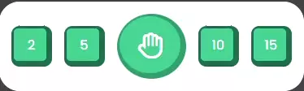
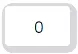
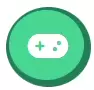

# Links
- <a href="https://github.com/JorgenBrattang/color-racing/blob/main/README.md">README.md</a>
- <a href="https://jorgenbrattang.github.io/color-racing/" title="Link to live website" rel="nofollow">View live website here!</a>

# Feature testing
## <u>Responsive test</u>
Video shows free resizing and three screens iPhone XR, iPad Air and Nest Hub Max.

- (It works for all sizes, and gives out an alert if you have less then 600px height to use )

## Features within the website

### <u>Full Round</u>

### <u>Color pillars</u>

### <u>Rounds Blinking</u>

### <u>Blinking Hand</u>

### <u>Colors blinking</u>

### <u>Hand blinking to praying figure</u>

### <u>Colors racing</u>

### <u>Score changing</u>

### <u>Reset Button</u>

### <u>Changing rounds</u>

### <u>High and latest Score</u>
 

### <u>New Game</u>

### <u>Instructions</u>

## Bug reports
The developer encounter a number of bugs throughout the development of this game, there were hurdles to overcome but those were fixed with either help from tutors, slack community or researching the internet.

A few worth mentioning:
- When starting the race, the colors would not start onces pressed.
    - Solution the progress bar was not working properly, which gave the if statement false information.
- Using the same button twice for different purpose, this gave the developer a headache.
    - Solutions changing the ID's and using if statements to check for information given and not given.
- Resizing the window for horizontal and portrait mode, this gave an unsuspected and unsolved bug within the inspect window in Chrome. As mentioned in Unfixed Bugs within the <a href="https://github.com/JorgenBrattang/color-racing/blob/main/README.md">README.md</a>

### <u>Websites on different browsers

## <u>Validator Testing</u>
Ran through all the code and no errors were found.
    
**HTML**
- No errors were returned when passing through the official [W3C validator](https://validator.w3.org/)

**CSS**
- No errors were found when passing through the official [(Jigsaw) validator](https://jigsaw.w3.org/css-validator/)    

**JavaScript**
- Ask if these are relevant [JS Hint](https://jshint.com/)    
